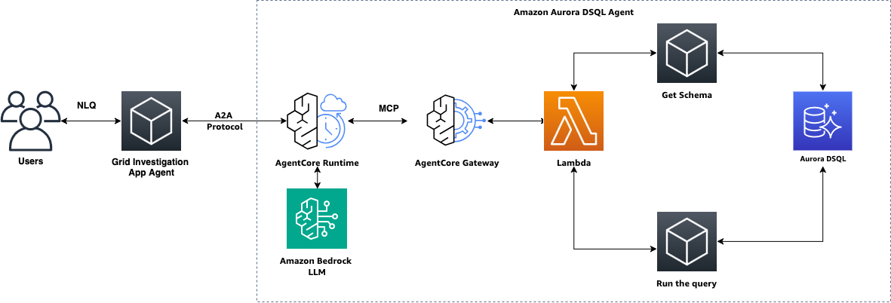

# Amazon Aurora DSQL Agent

A sample application demonstrating how to build an AI agent that queries Aurora DSQL using natural language. It uses Strands Agents for reasoning, Bedrock AgentCore Gateway for secure database access via MCP, and AgentCore Runtime for agent-to-agent communication. The included example uses a grid operations scenario to showcase multi-table correlation and parameterized SQL generation against DSQL.

## Use Case

Electrical grid operators need to quickly diagnose faults, outages, and anomalies across a distribution network. When a feeder trips or voltage goes unstable, the root cause could be weather, equipment failure, a bad switching operation, or deferred maintenance — and the answer usually lives across multiple data sources that are painful to query by hand under pressure.

This agent lets operators ask plain-English questions and get a correlated root-cause analysis in seconds. Under the hood it:

1. Parses the operator's question to extract the feeder ID and time window.
2. Generates the right combination of parameterized SQL queries (sensor readings, switching logs, transformer inspections, weather data, maintenance history) via the `query_grid_database` MCP tool backed by Aurora DSQL.
3. Correlates findings across all six tables and produces a timeline, contributing factors, root-cause assessment, and recommended corrective actions.

### Example queries

```
"Why did feeder F324 experience voltage instability between 2:10 and 2:20 PM on January 15th 2024?"
"What happened during the ice storm on feeder F112 on January 12th 2024? Was the transformer damaged?"
"What caused the outage on feeder F550 on January 16th 2024? Was the transformer overloaded?"
"What maintenance was done on feeder F324 in January 2024?"
"Give me a full incident summary for feeder F205 on January 14th 2024."
```

### Data model at a glance

| Table | What it stores |
|-------|---------------|
| `grid_incidents` | Outage/fault/voltage-instability records with severity and resolution time |
| `feeder_events` | Voltage, current, and frequency sensor readings per feeder |
| `switching_events` | Breaker open/close/reclose operations (manual and automated) |
| `transformer_inspections` | Load, oil temperature, and status from field inspections |
| `incident_weather` | Temperature, wind, precipitation, and lightning proximity |
| `maintenance_log` | Scheduled and completed repair/upgrade/inspection work |

## Architecture

The system uses a two-agent architecture communicating via the Bedrock AgentCore A2A (Agent-to-Agent) protocol:

- **App Agent** (`agent/agent.py`): A thin relay that receives operator questions via CLI and delegates them to the Database Agent via A2A. It does not connect to the database or generate SQL — it simply passes the question through and relays the response.
- **Database Agent** (`agent/database_agent.py`): A long-lived process registered with AgentCore Runtime. It connects to the AgentCore Gateway via MCP, fetches the live database schema at startup via the `get_schema` tool, generates parameterized SQL, queries all relevant tables, correlates results, and produces root-cause analyses.



```
Users
  │ NLQ (plain English question)
  ▼
App Agent (agent/agent.py)          ◄── Thin relay, no DB knowledge
  │ A2A Protocol (SigV4-signed HTTPS)
  ▼
AgentCore Runtime                   ◄── Hosts Database Agent as A2A server
  │
  ▼
Database Agent (agent/database_agent.py)  ◄── Bedrock LLM + full investigation workflow
  │ MCP (streamable HTTP + Cognito OAuth)
  ▼
AgentCore Gateway
  │
  ▼
Lambda (grid-investigation-tools)
  ├── get_schema    ──▶ Aurora DSQL (information_schema)
  └── query_grid_database ──▶ Aurora DSQL (6 grid tables)
```

---

## Prerequisites

- AWS account, AWS CLI configured (`aws configure`)
- Python 3.12+
- `psql` client installed locally (for schema setup)
- `bedrock-agentcore` CLI installed (`pip install bedrock-agentcore-starter-toolkit`)

---

## 0. Create the Aurora DSQL cluster

Aurora DSQL is serverless — there are no instances, VPCs, or security groups to configure. The cluster endpoint is publicly accessible and secured via IAM authentication.

```bash
# Create the cluster (deletion protection is on by default)
aws dsql create-cluster \
  --region us-east-1 \
  --tags Key=Name,Value=grid-investigation

# Poll until status is ACTIVE
aws dsql get-cluster --region us-east-1 --identifier <cluster-id>
```

Example response when ready:
```json
{
  "identifier": "abc0def1baz2quux3quuux4",
  "arn": "arn:aws:dsql:us-east-1:111122223333:cluster/abc0def1baz2quux3quuux4",
  "status": "ACTIVE"
}
```

The cluster endpoint is: `<identifier>.dsql.us-east-1.on.aws`

---

## 1. Apply the schema

```bash
# Generate a short-lived admin token
export PGPASSWORD=$(aws dsql generate-db-connect-admin-auth-token \
  --hostname <cluster-id>.dsql.us-east-1.on.aws \
  --region us-east-1)

psql "host=<cluster-id>.dsql.us-east-1.on.aws port=5432 dbname=postgres user=admin sslmode=require" \
  -f infra/schema.sql
```

### Load sample data

```bash
pip install aurora-dsql-python-connector psycopg2-binary boto3

python infra/load_sample_data.py --endpoint <cluster-id>.dsql.us-east-1.on.aws
```

This inserts 15 incidents, 15 feeder events, 10 switching events, 6 transformer inspections, 9 weather records, and 8 maintenance logs across feeders F324, F112, F205, F410, F550, F678, and F999.

---

## 2. Deploy Lambda + Gateway (one command)

The setup script handles everything: creates IAM roles (Lambda + Gateway), deploys the
Lambda, creates the AgentCore Gateway with Cognito OAuth, and registers the Lambda as an
MCP target with the tool schemas.

```bash
cd gateway
pip install boto3 bedrock-agentcore-starter-toolkit

python setup_gateway.py \
  --account-id <your-account-id> \
  --region us-east-1 \
  --dsql-endpoint <cluster-id>.dsql.us-east-1.on.aws \
  --lambda-file ../lambda/grid_tools/handler.py
```

This creates:

| Resource | Name |
|----------|------|
| Lambda role | `grid-investigation-lambda-role` (trust: `lambda.amazonaws.com`, policy: `dsql:DbConnectAdmin` + CloudWatch) |
| Gateway role | `grid-investigation-gateway-role` (trust: `bedrock-agentcore.amazonaws.com`, policy: `lambda:InvokeFunction`) |
| Lambda | `grid-investigation-tools` (Python 3.12, 512 MB, 30s timeout) |
| Gateway | `grid-investigation-gateway` (Cognito OAuth + semantic search enabled) |

The script outputs the environment variables you need for the agent. It also saves them
to `gateway/gateway_config.json`.


### MCP Tools exposed via Gateway

The Gateway exposes 2 tools. Instead of fixed query templates, the agent has full schema
context in its system prompt and generates parameterized SQL dynamically.

| Tool | Description | Parameters |
|------|-------------|------------|
| `query_grid_database` | Execute a parameterized read-only SQL query against Aurora DSQL. The agent generates the SQL with `%s` placeholders and passes values separately. Only SELECT queries are allowed. Results capped at 500 rows. | `sql` (string, required): SQL with `%s` placeholders. `parameters` (string array, optional): values for placeholders. |
| `get_schema` | Retrieve the live database schema from `information_schema`. Returns table names, column names, data types, and nullability for all grid tables. | None |

#### How it works

1. The agent's system prompt contains the full schema (6 tables, all columns, types, relationships, indexes).
2. When the operator asks a question, the agent reasons about which tables to query and generates parameterized SQL.
3. The Lambda validates the SQL (read-only SELECT, allowed tables only, no injection), appends a LIMIT if missing, and executes against DSQL.
4. The agent can make multiple queries to correlate data across tables, then synthesizes a root-cause analysis.

#### Safety guardrails in the Lambda

- Only `SELECT` and `WITH` (CTE) statements are allowed — `INSERT`, `UPDATE`, `DELETE`, `DROP`, etc. are rejected before execution.
- Only the 6 known tables can be referenced (`grid_incidents`, `feeder_events`, `switching_events`, `transformer_inspections`, `incident_weather`, `maintenance_log`).
- Multi-statement queries (`;` followed by another statement) are blocked.
- Results are capped at 500 rows with an auto-appended `LIMIT`.
- All parameters are passed via psycopg2's parameterized query interface (not string interpolation).

### Package and update Lambda dependencies

The Lambda uses `aurora-dsql-python-connector` and `psycopg2-binary` which need to be packaged as a layer or bundled into the deployment zip. After the initial deploy, return to the project root and update the function code with dependencies:

```bash
# Return to the project root (you are still in gateway/ from the previous step)
cd ..

pip install \
  --target /tmp/lambda_pkg \
  --platform manylinux2014_x86_64 \
  --only-binary=:all: \
  -r lambda/grid_tools/requirements.txt

cp lambda/grid_tools/handler.py /tmp/lambda_pkg/

cd /tmp/lambda_pkg && zip -r /tmp/grid-tools.zip . && cd -

aws lambda update-function-code \
  --function-name grid-investigation-tools \
  --zip-file fileb:///tmp/grid-tools.zip \
  --region us-east-1
```

### Gateway role trust policy (critical)

The Gateway role trust policy must be exactly this — no extra `Condition` blocks.
The starter toolkit's `fix_iam_permissions()` sometimes adds conditions that break
invocation. The setup script resets it automatically, but if you hit 403s, verify:

```bash
aws iam get-role --role-name grid-investigation-gateway-role \
  --query 'Role.AssumeRolePolicyDocument'
```

### Test the Lambda directly

```bash
aws lambda invoke \
  --function-name grid-investigation-tools \
  --payload '{"tool_name":"get_schema"}' \
  --cli-binary-format raw-in-base64-out \
  --region us-east-1 \
  /tmp/test_out.json && cat /tmp/test_out.json | python3 -m json.tool
```

### (Optional) least-privilege database role

By default the Lambda connects as `admin`. For production, create a read-only database role:

```bash
export PGPASSWORD=$(aws dsql generate-db-connect-admin-auth-token \
  --hostname <cluster-id>.dsql.us-east-1.on.aws \
  --region us-east-1)

psql "host=<cluster-id>.dsql.us-east-1.on.aws port=5432 dbname=postgres user=admin sslmode=require"
```

```sql
CREATE ROLE grid_app WITH LOGIN;
AWS IAM GRANT grid_app TO 'arn:aws:iam::<account-id>:role/grid-investigation-lambda-role';
GRANT USAGE ON SCHEMA public TO grid_app;
GRANT SELECT ON ALL TABLES IN SCHEMA public TO grid_app;
```

Then update `handler.py` to use `user="grid_app"` and change the IAM policy from
`dsql:DbConnectAdmin` to `dsql:DbConnect`.

---

## 3a. Deploy the Database Agent to AgentCore Runtime

This deploys the Database Agent as an A2A server on Bedrock AgentCore Runtime. The script runs `agentcore configure` and `agentcore launch`, then saves the agent ARN and endpoint details to `gateway/gateway_config.json`.

```bash
pip install -r agent/requirements.txt

python agent/register_database_agent.py --region us-east-1
```

After deployment you'll see:

```
Agent Name:    grid_database_agent
Agent ARN:     arn:aws:bedrock-agentcore:us-east-1:<account>:runtime/grid_database_agent-xxxxx
```

The agent ARN is saved to `gateway/gateway_config.json` under the `a2a` key. The App Agent reads it from there automatically.

To redeploy after code changes, just run the same command again — it updates the existing agent in place.

To check the agent status:

```bash
agentcore status -a grid_database_agent --verbose
```

---

## 3b. (Optional) Run the Database Agent locally

For local development and testing, you can run the Database Agent directly instead of deploying to AgentCore Runtime. Start it in a separate terminal:

```bash
python agent/database_agent.py [--region us-east-1] [--config gateway/gateway_config.json]
```

The Database Agent will:
1. Connect to the AgentCore Gateway via MCP (using Cognito OAuth from `gateway_config.json`)
2. Fetch the live database schema via the `get_schema` MCP tool
3. Start an A2A server on `localhost:9000`

Keep this process running while using the App Agent with `--local` flag.

---

## 4. Run the App Agent

The App Agent sends operator questions to the Database Agent via A2A protocol and prints the response. By default it connects to the deployed AgentCore Runtime agent using SigV4-signed requests (uses your AWS credentials).

```bash
# Remote mode (default) — talks to deployed agent on AgentCore Runtime
python agent/agent.py "Why did feeder F324 experience voltage instability between 2:10 and 2:20 PM?"

# Local mode — talks to database_agent.py running on localhost:9000
python agent/agent.py --local "Why did feeder F324 experience voltage instability between 2:10 and 2:20 PM?"
```

Remote mode requires:
- AWS credentials configured (e.g. `AWS_PROFILE=aws-dev`)
- The `a2a.agent_arn` field populated in `gateway/gateway_config.json` (done by the deploy step)

No other environment variables are needed.

### Sample questions to try

```bash
# Investigate a specific incident
python agent/agent.py "Why did feeder F324 experience voltage instability between 2:10 and 2:20 PM on January 15th 2024?"

# Ice storm analysis with transformer damage
python agent/agent.py "What happened during the ice storm on feeder F112 on January 12th 2024? Was the transformer damaged?"

# Equipment correlation
python agent/agent.py "What caused the outage on feeder F550 on January 16th 2024? Was the transformer overloaded?"

# Maintenance review
python agent/agent.py "What maintenance was done on feeder F324 in January 2024?"

# Full cross-table summary
python agent/agent.py "Give me a full incident summary for feeder F205 on January 14th 2024."

# Cable fault investigation
python agent/agent.py "What happened with the cable fault on feeder F678 on January 11th 2024?"

# Multi-incident investigation
python agent/agent.py "Feeder F324 had multiple incidents in January 2024. Give me a summary of all of them."
```


---

## Clean up

To avoid ongoing charges, delete the resources created in this walkthrough:

```bash
# Delete the AgentCore agent (also removes memory, execution role, and S3 artifacts)
agentcore destroy -a grid_database_agent

# Delete the Lambda function
aws lambda delete-function --function-name grid-investigation-tools --region us-east-1

# Delete IAM roles (remove inline policies first, then the role)
aws iam delete-role-policy --role-name grid-investigation-lambda-role --policy-name DSQLAccess
aws iam detach-role-policy --role-name grid-investigation-lambda-role \
  --policy-arn arn:aws:iam::aws:policy/service-role/AWSLambdaBasicExecutionRole
aws iam delete-role --role-name grid-investigation-lambda-role

aws iam delete-role-policy --role-name grid-investigation-gateway-role --policy-name LambdaInvokeAccess
# LambdaInvokePolicy may also exist if created by the toolkit's fix_iam_permissions() — ignore errors if not found
aws iam delete-role-policy --role-name grid-investigation-gateway-role --policy-name LambdaInvokePolicy
aws iam delete-role --role-name grid-investigation-gateway-role

# Delete the AgentCore Gateway target first, then the gateway
# (gateway-id and target-id are in gateway/gateway_config.json)
aws bedrock-agentcore-control delete-gateway-target \
  --gateway-identifier <gateway-id> \
  --target-id <target-id> \
  --region us-east-1

aws bedrock-agentcore-control delete-gateway \
  --gateway-identifier <gateway-id> \
  --region us-east-1

# Delete the Aurora DSQL cluster (disable deletion protection first)
aws dsql update-cluster --identifier <cluster-id> --no-deletion-protection-enabled --region us-east-1
aws dsql delete-cluster --identifier <cluster-id> --region us-east-1
```

### Clean up local files

```bash
# Remove generated config files
rm -f gateway/gateway_config.json agent/gateway_config.py

# Remove Lambda packaging artifacts
rm -rf /tmp/lambda_pkg /tmp/grid-tools.zip /tmp/test_out.json

# Remove agentcore configuration
rm -f .bedrock_agentcore.yaml

# (Optional) Remove the virtual environment
rm -rf .venv
```
