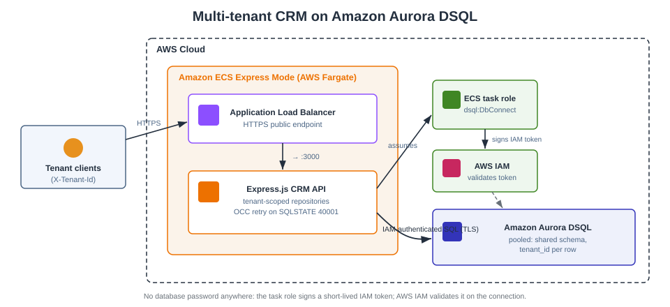

# Multi-tenant CRM on Amazon Aurora DSQL

A proof-of-concept multi-tenant CRM API built on
[Amazon Aurora DSQL](https://aws.amazon.com/rds/aurora/dsql/) — a serverless,
PostgreSQL-compatible distributed SQL database. It demonstrates the **pooled**
SaaS multi-tenancy model (shared schema with a `tenant_id` discriminator) with
tenant isolation enforced in a centralized data-access layer, IAM-based
database authentication, and Optimistic Concurrency Control (OCC) retries.

The service is a Node.js + Express (TypeScript) application designed to run on
[Amazon ECS Express Mode](https://docs.aws.amazon.com/AmazonECS/latest/developerguide/express-service.html),
which — like Aurora DSQL — is serverless: you manage no instances for either.

> This is a companion to
> [User authentication and session management with Amazon Aurora DSQL](https://aws.amazon.com/blogs/database/user-authentication-and-session-management-with-amazon-aurora-dsql/)
> and follows the same architecture and connector patterns.

## Architecture



> The diagram is committed as `diagrams/architecture.svg`. An equivalent
> official-AWS-icon version can be regenerated as `architecture.png` from
> [`diagrams/architecture.py`](diagrams/architecture.py) (requires the
> [`diagrams`](https://diagrams.mingrammer.com) library and Graphviz).

* **Amazon ECS Express Mode** — runs the containerized Express.js app on AWS
  Fargate with automatic scaling, load balancing, and an HTTPS endpoint.
* **Amazon Aurora DSQL** — stores all tenants' CRM data with strong
  read-after-write consistency and automatic scaling.
* **AWS IAM** — the ECS task role connects to Aurora DSQL with short-lived
  IAM tokens (`dsql:DbConnect`); there is no database password anywhere.

Request flow: client → ECS Express Mode (ALB → Fargate) → Express app resolves
the tenant, runs tenant-scoped business logic → Aurora DSQL via an
IAM-authenticated connection.

## Multi-tenancy model

This POC uses the **pooled** model: one shared set of tables, every
tenant-scoped row carries a `tenant_id`, and **every** query filters by it.

Aurora DSQL-specific design choices:

| Concern | Approach |
|---|---|
| Isolation | Centralized in the repository layer (`tenant_id` on every query). This data-access layer is the isolation boundary; you can push part of it into the database (for example, PostgreSQL `security_barrier` views, which Aurora DSQL supports) at the cost of some operational complexity. |
| Referential integrity | Foreign keys in the database for existence (Aurora DSQL supports FK constraints), plus a tenant-scoped ownership check in the application — a foreign key proves a parent exists, not that it belongs to the tenant. The polymorphic `activities.related_id` stays app-enforced. |
| Primary keys | Application-generated UUIDs (`crypto.randomUUID()`) spread writes across partitions. |
| Concurrency | OCC — writes go through `AuroraDSQLPool.transaction()`, which retries SQLSTATE `40001` with backoff. |
| Bulk writes | Batched under the 3,000-row-per-transaction limit (see `completeActivitiesFor`). |
| Migrations | One DDL statement per transaction; secondary indexes use `CREATE INDEX ASYNC`. |

In production, resolve the tenant from a verified identity (for example a
`custom:tenant_id` JWT claim issued by your identity provider), and connect as
a least-privilege `app_runtime` role rather than `admin`. This sample already
derives the tenant from a signed, verified bearer token (not a raw header), so
the pattern it demonstrates is secure by default.

## Data model

`tenants` (registry) → `users`, `accounts`, `contacts`, `opportunities`,
`activities` — all tenant-scoped. See [`sql/schema.sql`](sql/schema.sql).

## API endpoints

Tenant-scoped endpoints require an `Authorization: Bearer <token>` header whose
verified `tenant_id` claim selects the tenant. Mint a demo token with
`POST /api/tenants/:id/token`. (The tenant registry endpoints are
administrative and are not tenant-scoped.)

| Method | Endpoint | Description |
|---|---|---|
| GET | `/health` | Health check (used by ECS) |
| POST | `/api/tenants` | Create a tenant (admin) |
| GET | `/api/tenants` | List tenants (admin) |
| POST | `/api/tenants/:id/token` | Mint a bearer token for a tenant (demo) |
| POST | `/api/accounts` | Create an account |
| GET | `/api/accounts` | List accounts for the tenant |
| GET | `/api/accounts/:id` | Get one account |
| POST | `/api/contacts` | Create a contact (validates account) |
| GET | `/api/contacts?account_id=` | List contacts |
| POST | `/api/opportunities` | Create an opportunity |
| GET | `/api/opportunities?stage=` | List opportunities |
| PATCH | `/api/opportunities/:id` | Advance stage (OCC-protected) |
| POST | `/api/activities` | Create an activity |
| GET | `/api/activities?related_id=` | List activities |
| POST | `/api/activities/complete` | Bulk-complete (batched) |

## Prerequisites

* An AWS account with permission to create Aurora DSQL clusters, IAM roles,
  ECR repositories, and ECS Express Mode services.
* A default VPC with public subnets in your Region (Express Mode uses it).
* [AWS CloudShell](https://aws.amazon.com/cloudshell/) is the easiest place to
  run the scripts — the AWS CLI, Docker, Node.js 20+, `psql`, and credentials
  are already available. You can also run locally with those tools installed.

## Deploy (in AWS CloudShell)

```bash
git clone https://github.com/aws-samples/aurora-dsql-samples.git
cd aurora-dsql-samples/sample-amazon-aurora-dsql-multi-tenant-crm

export AWS_REGION=us-east-1

# 1. Provision DSQL, IAM, the container image, and the ECS Express service.
./scripts/deploy.sh

# 2. Create tables and the least-privilege app_runtime role (run once).
DSQL_ENDPOINT=<printed-by-deploy> ./scripts/setup-db.sh
```

`deploy.sh` prints the DSQL endpoint and the application URL
(`https://crm-dsql-poc.ecs.<region>.on.aws/`). It records state in
`scripts/.state.env` and is safe to re-run.

## Run locally

```bash
npm install
export DSQL_ENDPOINT="<cluster-id>.dsql.us-east-1.on.aws"
export DSQL_USER=admin          # for first-time migrate; use app_runtime after setup
export APP_JWT_SECRET="$(openssl rand -hex 32)"   # signs/verifies tenant bearer tokens
npm run migrate                 # create tables + async indexes
npm run seed                    # optional: two demo tenants with sample data
npm run dev                     # start the API on http://localhost:3000
```

The Aurora DSQL connector parses the Region from the cluster hostname and
generates IAM auth tokens automatically, so no password is needed — just AWS
credentials in your environment.

## Testing

```bash
# Create a tenant (admin), then mint a bearer token for it
TENANT=$(curl -s -X POST http://localhost:3000/api/tenants \
  -H 'Content-Type: application/json' -d '{"name":"Acme Corp"}' | jq -r .id)
TOKEN=$(curl -s -X POST http://localhost:3000/api/tenants/$TENANT/token | jq -r .token)

# Create an account for that tenant (authenticated with the token)
ACCOUNT=$(curl -s -X POST http://localhost:3000/api/accounts \
  -H "Authorization: Bearer $TOKEN" -H 'Content-Type: application/json' \
  -d '{"name":"Initech","industry":"Software"}' | jq -r .id)

# Add a contact and an opportunity
curl -s -X POST http://localhost:3000/api/contacts \
  -H "Authorization: Bearer $TOKEN" -H 'Content-Type: application/json' \
  -d "{\"account_id\":\"$ACCOUNT\",\"first_name\":\"Jane\",\"last_name\":\"Doe\"}" | jq

curl -s -X POST http://localhost:3000/api/opportunities \
  -H "Authorization: Bearer $TOKEN" -H 'Content-Type: application/json' \
  -d "{\"account_id\":\"$ACCOUNT\",\"name\":\"New deal\",\"amount\":25000}" | jq

# Tenant isolation: a token for a different tenant sees none of the above
OTHER=$(curl -s -X POST http://localhost:3000/api/tenants \
  -H 'Content-Type: application/json' -d '{"name":"Globex"}' | jq -r .id)
OTHER_TOKEN=$(curl -s -X POST http://localhost:3000/api/tenants/$OTHER/token | jq -r .token)
curl -s http://localhost:3000/api/accounts -H "Authorization: Bearer $OTHER_TOKEN" | jq  # [] empty

# A request with no bearer token is rejected (401)
curl -s -o /dev/null -w '%{http_code}\n' http://localhost:3000/api/accounts        # 401
```

## Clean up

```bash
./scripts/cleanup.sh    # deletes the DSQL cluster, ECS service, task role, and ECR repo
```

> **Warning:** cleanup permanently deletes the Aurora DSQL cluster and all CRM
> data. This cannot be undone.

## Project layout

```
src/
  index.ts              Express bootstrap + graceful shutdown
  db/pool.ts            AuroraDSQLPool (IAM auth, connection recycling)
  db/occ.ts             OCC transaction wrapper (delegates to pool.transaction)
  db/migrate.ts         One-DDL-per-transaction migration runner
  middleware/tenant.ts  Tenant-context resolution (verified token) + validation
  middleware/jwt.ts     HS256 bearer-token mint/verify (Node crypto, no deps)
  middleware/error.ts   Central error handling
  repositories/         Tenant-scoped data access (accounts, contacts, ...)
  routes/index.ts       HTTP API
  scripts/seed.ts       Demo data for two tenants
sql/schema.sql          Documented schema
scripts/                deploy.sh, setup-db.sh, cleanup.sh (CloudShell)
diagrams/architecture.py Architecture diagram as code (AWS icons)
```

## Security

See [CONTRIBUTING](CONTRIBUTING.md#security-issue-notifications) for reporting
security issues. This sample is a proof of concept; review and harden
(authentication, input validation, least-privilege roles, logging) before any
production use.

## License

This library is licensed under the MIT-0 License. See the [LICENSE](LICENSE) file.
