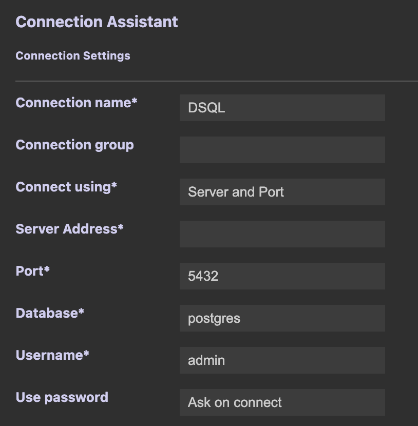

# How to connect to Aurora DSQL from VSCode using the SQLTools extension 

SQLTools is a Visual Studio Code extension that provides database management features such as data preview, querying, and editing directly within the editor.

1. Open Visual Studio Code. 

2. In the left panel, click on the "Extensions" button.    


3. Click on "Search Extensions in Marketplace" and type in the following. 
```
SQLTools
```


4. Select "SQLTools" in the search result and click the "Install" button.

5. Next install the PostgreSQL driver by typing in the following in the search bar. 
```
@tag:sqltools-driver postgresql
```


6. Click on the install button for "SQLTools PostgreSQL/Cockroach Driver". 

7. After SQLTools and the PostgreSQL driver are installed , click on the "SQLTools" icon in the left panel. 
 

8. Click on the "Add New Connection" button under Connections. 


9. Under Connection Assistant, select PostgreSQL.


10. Fill in the following items: 
    - Connection Name: DSQL 
    - Server Address: <your_cluster_endpoint_host>
    - Database: postgres
    - Username: admin
    - Use Password: Ask on Connect 


11. Make sure SSL is "Enabled" and ensure rejectUnauthorized is checked.


12. Scroll to the bottom and click on the "SAVE CONNECTION" button on the left.

13. Click the "CONNECT NOW" button on the bottom left.

14. A password prompt will appear at the top of the screen. Paste the authentication token as the password and press "Enter".
[Generating an authentication token in Amazon Aurora DSQL](https://docs.aws.amazon.com/aurora-dsql/latest/userguide/SECTION_authentication-token.html)


15. Once you see the green dot in the PostgreSQL logo, you have successfully connected to your cluster and can start running SQL statements.


